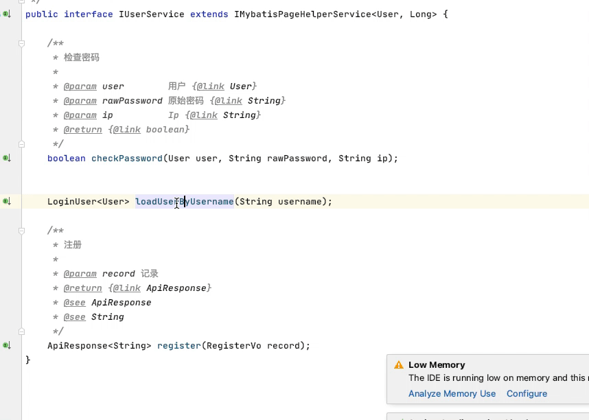

### Spring & Java tools

* spring request toolkit

* Generate SerialVersionUID for java class
  
* Generate getter setter method with field comment
* Add Javadoc comments, using biying translate api to translate English to Chinese

* Add Swagger Annotation Generator

Usage: ALT + Enter

## Spring和Java常用工具插件
* 查看&搜索API接口
* 生成序列化ID 
* 生成get set方法
* 添加注释，使用必应的API自动翻译（英文到中文）
* 添加Swagger注解生成器

用法: ALT + Enter

### Thanks

[gen-javadoc](https://github.com/bpark/gen-javadoc)

## Star History

